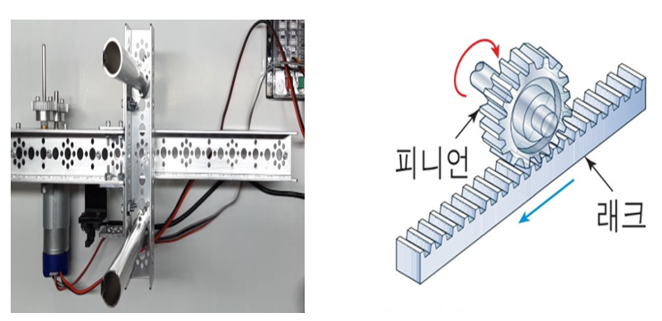

# Smart-AGV-Robot
## 개발
- Aduino, C, C++

## 미리보기

## 개요
- 정해진 경로를 따라 독립적으로 움직이는 무인 이송 로봇
- 분류 기준에 따른 효율적이고 신속한 문류 운반
- 구조적으로 견고하며 센서를 사용해 정밀한 위치제어 가능

## 구성요소
- 컨트롤러  

- 센서 

- 3D print 

- 휠 

- 리프트 
